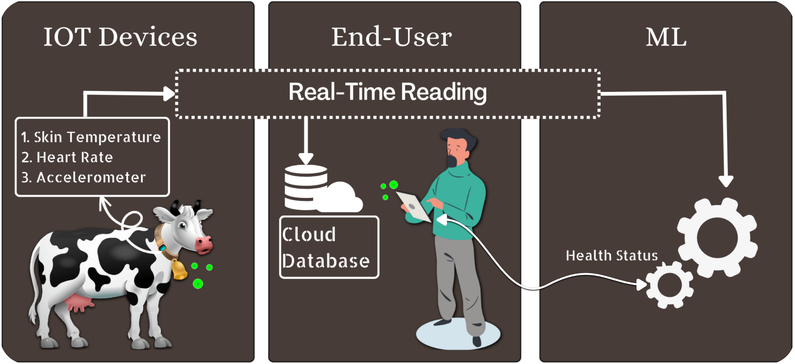

# IoT-Based Cow Monitoring System



## Table of Contents

- [Introduction](#introduction)
- [Features](#features)
- [Hardware Components](#hardware-components)
- [Software Components](#software-components)
- [System Design](#system-design)
- [How to Use](#how-to-use)
- [Code Explanation](#code-explanation)
- [License](#license)
- [References](#references)

---

## Introduction

The IoT-Based Cow Monitoring System is an embedded system project designed to monitor vital health and activity parameters of cows. It provides real-time data such as heart rate, SpO2 levels, temperature, humidity, and motion metrics to ensure the well-being of livestock. The system is powered by an ESP32 microcontroller and employs various sensors to gather and transmit data to a ThingsBoard server for visualization and analysis.

## Features

- Real-time monitoring of cow health parameters.
- Displays data on an OLED screen for on-site visualization.
- Sends telemetry data to the ThingsBoard IoT platform for remote monitoring.
- Implements multi-core processing on the ESP32 for efficiency.

## Hardware Components

1. **ESP32 Microcontroller**
   - Core of the system, handles sensor data acquisition, processing, and communication.
2. **DHT11 Sensor**
   - Measures temperature and humidity.
3. **MAX30100 Pulse Oximeter Sensor**
   - Monitors heart rate and SpO2 levels.
4. **MPU6050 Accelerometer and Gyroscope**
   - Detects motion and provides 3-axis acceleration and gyro readings.
5. **Adafruit SH1106 OLED Display**
   - Displays real-time data locally.

## Software Components

- Arduino IDE for programming.
- Libraries used:
  - `WiFi.h` and `PubSubClient.h` for Wi-Fi and MQTT communication.
  - `Adafruit_GFX` and `Adafruit_SH110X` for OLED display.
  - `DHT.h` for temperature and humidity sensor.
  - `MAX30100_PulseOximeter.h` for pulse oximeter.
  - `Adafruit_MPU6050` and `Adafruit_Sensor` for motion detection.

## System Design

The system gathers sensor data and processes it using the ESP32. Data is visualized on the OLED and transmitted to the ThingsBoard server via MQTT. Below is an example telemetry structure:

```json
{
  "heartrate": 75,
  "spo2": 98,
  "temperature": 25.6,
  "humidity": 68,
  "Ax": 0.12,
  "Ay": 0.05,
  "Az": 9.81,
  "Gx": 0.01,
  "Gy": 0.02,
  "Gz": 0.03
}
```

## How to Use

1. **Hardware Setup**:
   - Connect the DHT11, MAX30100, and MPU6050 sensors to the ESP32 as per their pin configurations.
   - Attach the SH1106 OLED display to the I2C pins.
2. **Software Configuration**:
   - Clone this repository and open the `.ino` file in Arduino IDE.
   - Update the Wi-Fi credentials and ThingsBoard token in the code.
3. **Upload the Code**:
   - Compile and upload the code to the ESP32.
4. **View Data**:
   - Monitor real-time data on the OLED screen and ThingsBoard platform.

## Code Explanation

The code is divided into two main tasks running on different cores of the ESP32:

- **Core 0**:
  - Handles Wi-Fi and MQTT communication.
  - Publishes sensor data to the ThingsBoard server.
- **Core 1**:
  - Handles sensor data acquisition and OLED display updates.

Key functions:

- `setupWiFi()`: Connects the ESP32 to Wi-Fi.
- `reconnect()`: Ensures MQTT connection is active.
- `core0Task()`: Publishes sensor telemetry to ThingsBoard.
- `core1Task()`: Reads sensor data and updates the OLED display.

## License

This project is licensed under the MIT License - see the [LICENSE](LICENSE) file for details.

## References

- [ESP32 Documentation](https://docs.espressif.com/projects/esp-idf/en/latest/)
- [ThingsBoard Platform](https://thingsboard.io/)
- [Adafruit SH1106 OLED Documentation](https://learn.adafruit.com/monochrome-oled-breakouts)
- [DHT11 Sensor Datasheet](https://www.sparkfun.com/datasheets/Sensors/Temperature/DHT11.pdf)
- [MAX30100 Pulse Oximeter Datasheet](https://datasheets.maximintegrated.com/en/ds/MAX30100.pdf)
- [MPU6050 Datasheet](https://invensense.tdk.com/products/motion-tracking/6-axis/mpu-6050/)

